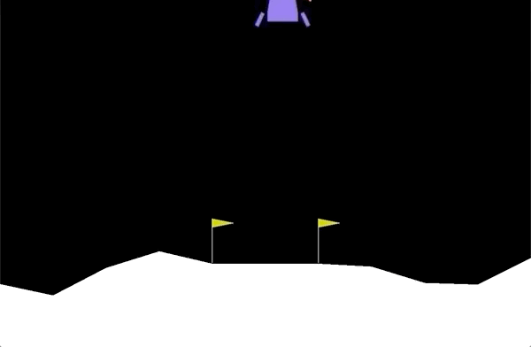
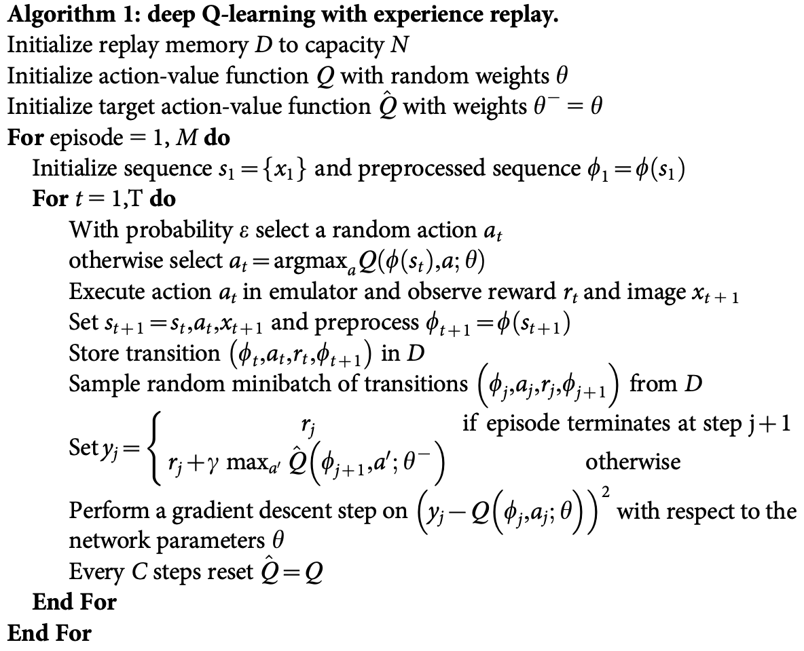
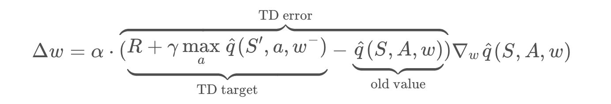

# Deep Q-Network (DQN)

## Function Approximation

Given a problem domain with continuous states s∈S=Rn, we wish to find a way to represent the value function vπ(s) (for prediction) or qπ(s,a) (for control).

We can do this by choosing a parameterized function that *approximates* the true value function:

- v^(s,w)≈vπ(s)
- q^(s,a,w)≈qπ(s,a)

Our goal then reduces to finding a set of parameters w that yield an optimal value function. We can use the general reinforcement learning framework, with a Monte-Carlo or Temporal-Difference approach, and modify the update mechanism according to the chosen function.

### Feature Vectors

A common intermediate step is to compute a feature vector that is representative of the state: x(s). The Deep Q-Learning algorithm represents the optimal action-value function q∗ as a neural network (instead of a table).

Unfortunately, reinforcement learning is [notoriously unstable](http://citeseerx.ist.psu.edu/viewdoc/download?doi=10.1.1.73.3097&rep=rep1&type=pdf) when neural networks are used to represent the action values. 

The Deep Q-Learning algorithm, addressed these instabilities by using **two key features**:

- Experience Replay
- Fixed Q-Targets

### Algorithm - DQN

------

When the agent interacts with the environment, the sequence of experience tuples can be highly correlated. The naive Q-learning algorithm that learns from each of these experience tuples in sequential order runs the risk of getting swayed by the effects of this correlation.By instead keeping track of a **replay buffer** and using **experience replay** to sample from the buffer at random, we can prevent action values from oscillating or diverging catastrophically.

The **replay buffer** contains a collection of experience tuples (S, A, R, S′). The tuples are gradually added to the buffer as we are interacting with the environment.

The act of sampling a small batch of tuples from the replay buffer in order to learn is known as **experience replay**. In addition to breaking harmful correlations, experience replay allows us to learn more from individual tuples multiple times, recall rare occurrences, and in general make better use of our experience.

In Q-Learning, we **update a guess with a guess**, and this can potentially lead to harmful correlations. To avoid this, we can update the parameters w in the network q^ to better approximate the action value corresponding to state S and action A; where w− are the weights of a separate target network that are not changed during the learning step, and (S, A, R, S′) is an experience tuple.

### Resources

- [Human-Level Control through Deep Reinforcement Learning](https://storage.googleapis.com/deepmind-media/dqn/DQNNaturePaper.pdf)
- [Deep Reinforcement Learning with Double Q-Learning](https://arxiv.org/abs/1509.06461)
- [Dueling Network Architectures for Deep Reinforcement Learning](https://arxiv.org/abs/1511.06581)
- [Prioritized Experience Replay](https://arxiv.org/abs/1511.05952)

### Instructions

This project is a part of [Udacity Deep Reinforcement Learning Nanodegree](https://www.udacity.com/course/deep-reinforcement-learning-nanodegree--nd893). To begin follow the instructions in `Deep_Q_Network.ipynb`.
